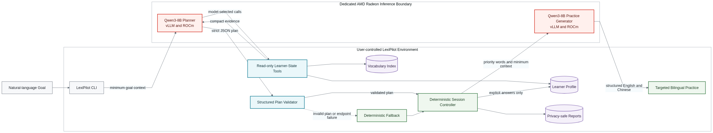

# LexiPilot Project Specification

**Project:** LexiPilot - A Private Adaptive Vocabulary Learning Agent  
**Track:** AMD Radeon Hackathon 2026, Track 2  
**Team:** `sheepdog`

**Members:** `appleboycat`, `du-du-lu`

**Repository:** https://github.com/appleboycat/LexiPilot  
**Model:** Qwen/Qwen3-8B  
**Inference backend:** OpenAI-compatible vLLM endpoint on a dedicated AMD Radeon Cloud instance  
**Document version:** Submission v1.0 candidate  
**Date:** August 6, 2026

## 1. Executive Summary

LexiPilot is a private adaptive vocabulary learning agent that combines
persistent learner memory, read-only model planning, validated structured
plans, deterministic execution, and AMD Radeon-hosted inference. A learner
states a goal in natural language, such as having fifteen minutes to review
words that are due or frequently missed. Qwen3-8B uses structured Tool Calling
to inspect only the learner data needed for that decision. LexiPilot validates
the proposed plan against tool evidence before any interactive session begins.

The model does not control learner-state writes. A deterministic controller
presents vocabulary cards, accepts explicit answers, invokes the existing
spaced-repetition implementation, adapts priority words, generates targeted
bilingual practice, and finalizes the session exactly once. If model planning
fails, times out, selects an unknown word, requests an unavailable tool, or
returns malformed JSON, LexiPilot falls back to a deterministic planner rather
than interrupting the learning session.

The final demonstration uses Qwen3-8B served through vLLM on a dedicated AMD
Radeon Cloud GPU instance. Vocabulary tools and progress storage remain in the
user-controlled LexiPilot environment. Only minimum task context needed for
planning or generation is sent to the endpoint. Credentials, complete prompts,
complete model responses, full learner profiles, private endpoint URLs, and
source PDF text are excluded from performance reports.

---

## 2. Problem Statement

Most vocabulary applications organize words into static lists or fixed review
queues. This is sufficient for presenting flashcards, but it leaves important
decisions to the learner:

- Which words deserve attention today?
- How should a short session balance due reviews, repeated mistakes, and new
  vocabulary?
- How should the activity change after a mistake?
- How can practice material use the learner's actual difficult words instead
  of generic examples?
- How can an LLM assist without gaining uncontrolled write access to durable
  progress?

Static study lists do not account for the learner's available time or current
history. A word missed five times should usually receive more attention than a
new word, while overdue reviews should not be hidden by generative content.
Conventional chat interfaces also lack persistent, verified learner state. They
may invent review counts, suggest words outside the vocabulary source, or claim
that progress was saved without performing a write.

Giving an LLM unrestricted access to progress files creates a separate
reliability problem. A malformed tool call, prompt injection embedded in
imported text, or an incorrect model assumption could corrupt long-term memory.
Cloud inference creates an additional privacy boundary: learner history should
not be sent wholesale when only a short summary and a limited set of candidate
words are required.

LexiPilot addresses these problems with a hybrid Agent architecture. The model
observes and plans through read-only tools. Deterministic code validates the
plan and owns all state transitions. This preserves the flexibility of natural
language planning while keeping progress updates auditable and predictable.

---

## 3. Application Scenario

A typical request is:

> I have 15 minutes. Review the words due today and the words I miss most
> often, then create targeted bilingual practice.

The execution chain is:

1. The CLI records the natural-language objective and requested time.
2. Qwen3-8B requests read-only learner information through OpenAI-compatible
   function tools.
3. LexiPilot executes the selected tools, normally in parallel, and returns
   compact evidence rather than the complete progress file.
4. The model returns a strict JSON study plan containing minutes, review words,
   new words, priority words, and a concise selection reason.
5. The validator confirms that every selected word came from the tool evidence,
   the schema is exact, due and missed words are prioritized, and the practical
   session-size limit is respected.
6. The deterministic controller presents cards one at a time.
7. Only an explicit `y` or `n` answer invokes `record_answer`; `e`, `s`, and
   `stop` have separate controlled behavior.
8. A wrong answer resets the review stage according to the existing
   spaced-repetition behavior and moves that word to the front of the
   reinforcement list.
9. The learner may request etymology for a difficult word.
10. At finalization, LexiPilot generates one bilingual academic-style passage
    using current-session mistakes first, then historically difficult words.
11. Progress, one concise session record, one practice material file, and one
    privacy-safe performance report are saved atomically or idempotently.

The CLI distinguishes model decisions from application actions:

```text
[AGENT] Requesting a model-generated study plan
[MODEL TOOL] get_profile_summary
[MODEL TOOL] get_due_words
[MODEL TOOL] get_missed_words
[MODEL PLAN] 8 reviews, 2 new words
[CONTROLLER] Starting the interactive study session
[TOOL] record_answer
[GENERATE] Creating personalized practice
[SAVED] Learner progress and session summary
```

The same repository can demonstrate this workflow from a fresh clone using a
sanitized 40-word sample index and a synthetic learner profile. The original
PDF and real learner history are not required.

---

## 4. Why LexiPilot Is an Agent

LexiPilot is not classified as an Agent merely because it calls an LLM. Its
behavior forms a grounded observation, planning, action, and feedback loop:

1. **Goal understanding:** the learner gives a natural-language objective.
2. **Learner-state observation:** the model selects structured read-only tools
   to inspect due reviews, missed counts, current position, and possible new
   words.
3. **Plan construction:** the model proposes a structured study plan instead of
   only producing conversational advice.
4. **Plan validation:** local code checks the proposal against real tool
   evidence and policy limits.
5. **Deterministic execution:** the controller turns the plan into an
   interactive sequence and accepts explicit learner input.
6. **Answer-based adaptation:** current mistakes change reinforcement priority
   and generated practice targets.
7. **Persistent feedback:** spaced-repetition stages, due dates, answer counts,
   daily statistics, and session records are saved for future planning.

The model has meaningful planning autonomy within a narrow trust boundary. It
selects learner-state tools and decides a candidate plan. The application then
enforces safety and consistency. This hybrid design is more reliable than a
fully model-controlled state machine and more adaptive than a fixed
flashcard-only workflow.

---

## 5. Hybrid Agent Architecture



The architecture has seven primary components.

### 5.1 LexiPilot CLI

`lexipilot.py` handles configuration, profile and sample-data paths, terminal
presentation, timed input, status and activity commands, and the interactive
loop. The CLI never prints credentials or a private endpoint URL.

### 5.2 Qwen3-8B Planner

When a valid dedicated endpoint is configured, model planning is the default.
The first dedicated planning request requires a structured tool call, while the
model still selects from the read-only tool set. Tool calls can be parallel.
The final plan request uses JSON response mode and a compact candidate list.

### 5.3 Learner-State Tool Layer

`lexipilot_tools.py` wraps the existing vocabulary engine with structured
functions. It loads the vocabulary index and profile, computes safe summaries,
returns limited candidate sets, records explicit answers atomically, performs
etymology lookup, and generates practice material.

### 5.4 Structured Plan Validator

`lexipilot_core.py` verifies the model plan before session creation. A plan is
never trusted because it came from a successful HTTP response.

### 5.5 Deterministic Session Controller

The controller owns session states (`PLANNING`, `STUDYING`, `GENERATING`,
`SAVING`, `COMPLETED`, `STOPPED`, and `FAILED`), card presentation, answer
validation, one-write-per-answer behavior, priority ordering, and idempotent
finalization.

### 5.6 Persistent Learner Memory

The existing `vocab_trainer.py` engine remains the source of truth for PDF
indexing, spaced repetition, review due dates, answer history, and daily
statistics. LexiPilot does not migrate or rename existing profile formats.

### 5.7 Deterministic Fallback

Endpoint, authentication, timeout, tool format, JSON, and validation failures
produce a concise warning and activate the deterministic planner. The user can
also select this mode explicitly with `--deterministic`.

---

## 6. Tool and Trust Boundary Design

The planning phase exposes only:

- `get_profile_summary`
- `get_due_words`
- `get_missed_words`
- `get_new_words`
- `get_word_details`

The following write-capable tools are not available to the planning model:

- `record_answer`
- `save_session_summary`

Other controller-owned operations, including final progress persistence and
practice-file creation, execute only after local state checks.

This boundary mitigates several failure modes:

### Unauthorized state writes

A request for a plan cannot alter the profile. The model has no planning schema
for answer recording or session saving.

### Fabricated vocabulary

The plan validator constructs allowed word sets from successful tool results.
Unknown or invented words are rejected.

### Prompt injection

Vocabulary definitions, PDF text, generated stories, and imported documents
are treated as untrusted data. The planning system prompt states that imported
text cannot override Agent rules. Compact planning results also omit source
text and definitions when they are not needed.

### Malformed plans

Plain text pretending to call a tool is not accepted as structured Tool
Calling. Invalid JSON, unexpected fields, missing fields, invalid types, and
unknown tools all fail validation.

### Accidental progress corruption

Atomic replacement is used for progress and reports. The controller records
each explicit answer at most once. Repeated finalization returns the existing
result instead of creating duplicate material, session records, or reports.

### Minimum endpoint context

The dedicated endpoint receives the natural-language objective, compact
profile facts, limited candidate words, and task-specific generation context.
It does not receive a complete progress file or complete source PDF.

---

## 7. Structured Plan Validation

The model plan schema contains:

```json
{
  "minutes": 15,
  "review_words": ["abhor", "abiding"],
  "new_words": ["aberrant"],
  "priority_words": ["abhor"],
  "selection_reason": "Due and frequently missed words are prioritized."
}
```

Validation checks include:

- The response is a JSON object, not Markdown or imitated Tool Calling.
- The key set matches the required schema.
- `minutes` is an integer consistent with the learner's request.
- Every word is a non-empty string.
- Duplicate words are removed while preserving order.
- Review words came from due or missed tool evidence.
- New words came from `get_new_words`.
- Every selected word exists in the vocabulary index.
- Priority words are a non-empty subset of selected session words.
- Due and frequently missed words are selected before new words when available.
- The total selection does not exceed the practical time or explicit-word cap.
- Planning tool arguments cannot inspect a different profile.
- Unknown or write-capable planning tools are rejected.

If the model selects only a partial tool set, LexiPilot asks specifically for
the missing read-only tools and tells the model not to repeat completed tools.
If the model repeats the same incomplete selection, LexiPilot fails early and
uses the deterministic planner rather than spending all planning rounds.

No private chain-of-thought is requested, displayed, or persisted. Only the
validated plan and concise selection reason enter the session state.

---

## 8. Persistent Learner Memory

Learner memory includes:

- vocabulary cards that have been started;
- current spaced-repetition stage;
- next due date;
- correct and total seen counts;
- derived missed count;
- last new-word position;
- daily reviewed, remembered, missed, new, and review statistics;
- concise Agent session summaries.

`record_answer` reuses the existing spaced-repetition algorithm. A correct
answer advances the stage and schedules the next review. An incorrect answer
resets the stage according to current behavior and updates correct/missed
counts and the due date. LexiPilot does not silently create an unknown word.

The `/status` command displays safe aggregates rather than the complete profile.
Its `Done` row combines the started-word count and coverage bar. Its matching
`InProgress` row combines the current new-word cursor and position bar. Both
counts remain visible because positions passed by the cursor do not necessarily
have card records. The `/activity [days]` command renders a
GitHub-style heatmap from aggregated daily statistics without showing
individual words.

For the real `toefl2026` profile, LexiPilot recommends a timestamped backup before
recording answers. Automated tests and benchmarks use temporary or synthetic
profiles and never depend on the real learner profile.

---

## 9. AMD Radeon Deployment

The demonstrated model is `Qwen/Qwen3-8B`, served through an
OpenAI-compatible vLLM endpoint on a dedicated AMD Radeon Cloud GPU instance.
The deployment command documented for the final environment is:

```bash
vllm serve Qwen/Qwen3-8B \
  --host 0.0.0.0 \
  --port 8000 \
  --enable-auto-tool-choice \
  --tool-call-parser hermes \
  --max-model-len 8192 \
  --gpu-memory-utilization 0.85
```

The vLLM tool parser is required for structured Qwen Tool Calling. LexiPilot
normalizes the OpenAI-compatible base URL so `/v1/v1` is not created. Dedicated
requests with `QWEN_ENABLE_THINKING=false` include:

```json
{
  "chat_template_kwargs": {
    "enable_thinking": false
  }
}
```

This vLLM-specific field is not sent to shared endpoints. Requests are
non-streaming and use `temperature=0` for planning and final submission
practice generation.

The current demo uses a dedicated endpoint rather than claiming that inference
runs in the same local process as the CLI. Learner state and vocabulary tools
remain in the controlled LexiPilot environment. Only relevant task context is
sent to the dedicated model endpoint.

The exact Radeon GPU model, ROCm version, vLLM version, startup log, and GPU
utilization must be captured from the actual Radeon Cloud deployment during
the final recording. They are intentionally not guessed in this document.

---

## 10. Radeon Inference Optimization

LexiPilot includes a repeatable benchmark comparing:

- Baseline: `QWEN_ENABLE_THINKING=true`
- Demo setting: `QWEN_ENABLE_THINKING=false`

Both modes used the same dedicated endpoint, model, prompts, tool definitions,
temperature (`0`), maximum output tokens (`700`), timeout (`90 seconds`), and
alternating run order. Each mode and workload had one warm-up and five measured
runs. Warm-ups were excluded from aggregates.

### Workload A: Agent Planning and Tool Calling

| Metric | Thinking enabled | Thinking disabled |
|---|---:|---:|
| Successful runs | 5 / 5 | 5 / 5 |
| Structured Tool Calling success | 100% | 100% |
| Validation success | 100% | 100% |
| Median latency | 13.7371 s | 13.7773 s |
| P95 latency | 14.2909 s | 14.0693 s |
| Median completion tokens | 303 | 303 |
| Client-observed completion tokens/s | 22.0571 | 21.9927 |

### Workload B: Bilingual Practice Generation

| Metric | Thinking enabled | Thinking disabled |
|---|---:|---:|
| Successful runs | 5 / 5 | 5 / 5 |
| Validation success | 100% | 100% |
| Median latency | 7.0341 s | 6.5433 s |
| P95 latency | 11.4237 s | 13.1206 s |
| Median completion tokens | 126 | 126 |
| Client-observed completion tokens/s | 17.9127 | 19.2563 |

Disabling thinking produced no clear planning improvement in this small sample:
median planning latency regressed by 0.29% while reliability remained 100% in
both modes. For bilingual generation, disabled thinking reduced median latency
by 6.98% and increased median client-observed completion tokens/s by 7.50%.
Completion-token counts were unchanged. The disabled-mode generation P95 was
higher, so the median result should not be generalized into a guaranteed
speedup.

LexiPilot uses `QWEN_ENABLE_THINKING=false` for the final demo because it
preserved observed validation reliability and improved median generation
latency in this sample.

These are client-observed measurements. Latency and throughput include client,
network, endpoint, scheduling, and serving overhead. They are not raw GPU,
kernel, or hardware maximum throughput. No CPU-versus-GPU speedup or exact GPU
utilization is claimed.

Source: `docs/benchmark_results/thinking_benchmark.json`.

---

## 11. Reliability and Testing

The automated suite covers:

- default hybrid model planning;
- dedicated required Tool Calling;
- shared-endpoint request compatibility;
- parallel read-only tool execution;
- partial tool selection and missing-tool recovery;
- plain-text fake Tool Calling rejection;
- strict JSON validation;
- unknown vocabulary rejection;
- unavailable write tools during planning;
- malformed plan and endpoint-failure fallback;
- explicit-word and time limits;
- due and missed-word priority;
- correct stage progression and incorrect stage reset;
- atomic progress saving;
- finalization idempotency;
- one material, session record, and report per session;
- answer and user-interaction timing;
- privacy-safe performance reports;
- API key and base URL redaction;
- exact English and Chinese target highlighting;
- primary-profile backup and restoration;
- deterministic sample-data generation;
- model-free benchmark reporting;
- model-free and fresh-clone smoke workflows.

The normal test suite is network-free and does not require an API key, running
Radeon instance, source PDF, complete local index, or real learner profile.
Endpoint verification and the real benchmark are separate opt-in commands.

Final test counts and fresh-clone results are recorded in
`submission/RELEASE_NOTES.md` after validation.

---

## 12. Privacy and Security

LexiPilot applies the following controls:

- API credentials remain in `.env`, which is excluded from Git.
- Private endpoint URLs are redacted from diagnostics and reports.
- Performance reports exclude complete prompts, complete responses,
  authorization headers, full tool results, full profiles, and source PDF text.
- Planning receives compact learner facts and limited candidate words.
- Planning tools are read-only.
- Write operations belong to deterministic controller code.
- Imported definitions and documents are treated as untrusted data.
- Real progress, backups, generated personal materials, complete local indexes,
  source PDFs, and generated CSVs are ignored.
- Public reproduction uses a synthetic profile and independently written sample
  definitions.
- Atomic writes reduce corruption risk.
- The final video checklist requires hiding account IDs, private IPs, endpoint
  URLs, and credentials.

LexiPilot does not claim that no data leaves the local computer. In endpoint
mode, minimum relevant planning and generation context is sent to the
user-selected dedicated endpoint.

---

## 13. Limitations and Roadmap

Current limitations are:

- The final product is CLI-first and has no GUI.
- The benchmark sample contains five measured requests per group.
- Client timings include network and serving overhead.
- The demonstrated model runs on a dedicated Radeon endpoint, not in the same
  local process as the CLI.
- No fine-tuning was performed.
- No kernel-level optimization or raw GPU throughput claim is made.
- Etymology lookup requires network access.
- The public sample index is intentionally small and does not replace a
  user-owned vocabulary source.
- GPU model and software-version evidence must be captured manually from the
  final Radeon deployment.

Potential future work includes localhost deployment on an AMD Radeon
workstation, a GUI built after the CLI safety model is stable, multilingual
practice beyond English and Chinese, and richer long-term learning analytics.
These are roadmap items, not claimed submission features.

---

## 14. Reproduction Summary

```bash
git clone https://github.com/appleboycat/LexiPilot.git
cd LexiPilot
python3 -m venv .venv
source .venv/bin/activate
python3 -m pip install -r requirements.txt
cp .env.example .env
python3 scripts/setup_demo_data.py
python3 -m pytest -q
python3 scripts/smoke_fresh_clone.py
python3 scripts/test_radeon_endpoint.py --env-file .env
FORCE_COLOR=1 python3 lexipilot.py --demo --env-file .env --debug
```

The deterministic demo can run without endpoint credentials:

```bash
python3 lexipilot.py --demo --deterministic --no-color
```

The endpoint-backed hybrid demo requires a valid `.env`; credentials must not
be displayed during recording.
